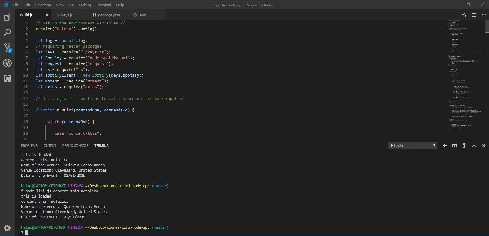
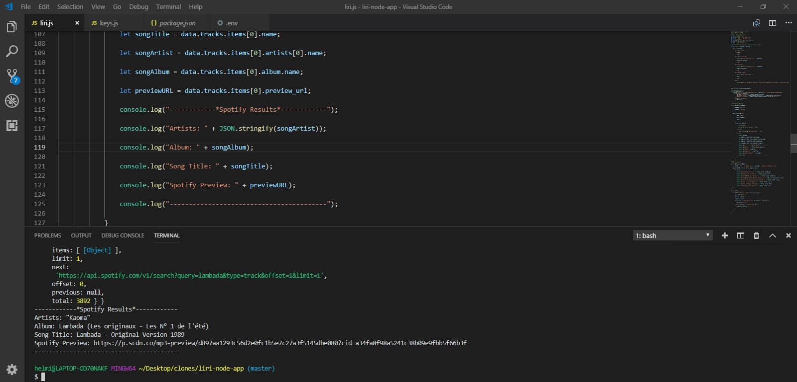
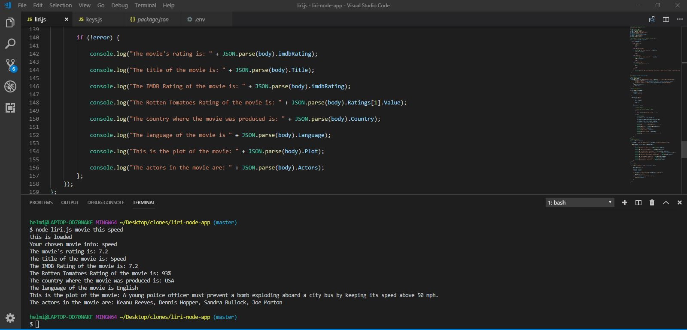

# liriNode
## Overview

In this assignment, you will make LIRI. LIRI is like iPhone's SIRI. However, while SIRI is a Speech Interpretation and Recognition Interface, LIRI is a Language Interpretation and Recognition Interface. LIRI will be a command line node app that takes in parameters and gives you back data.

## What Each Command Should Do
LIRI will search Spotify for songs, Bands in Town for concerts, and OMDB for movies.
This will show the following information about the song in your terminal/bash window
* concert-this
* spotify-this-song
* movie-this
* do-what-it-says

Artist(s)
The song's name
A preview link of the song from Spotify
The album that the song is from

node liri.js movie-this '<movie name here>'
* Title of the movie.
* Year the movie came out.
* IMDB Rating of the movie.
* Rotten Tomatoes Rating of the movie.
* Country where the movie was produced.
* Language of the movie.
* Plot of the movie.
* Actors in the movie.

